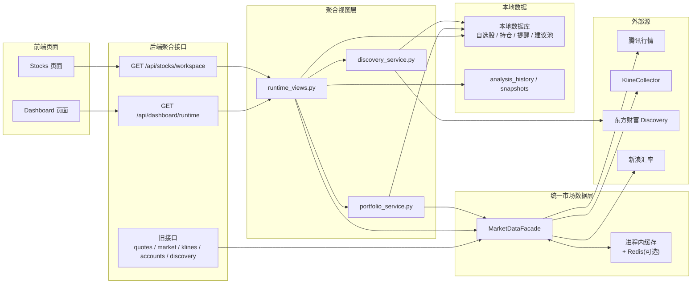
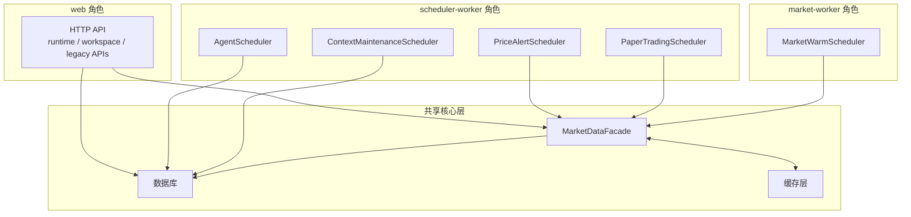

# PanWatch 全链路性能重构设计归档

基准日期：`2026-04-09`

## 一句话结论

当前这轮重构的核心，不是单点优化某个页面，而是把原先“前端多路请求 + 后端多处直连外部源 + scheduler 与 Web 争抢行情”的结构，收敛成“聚合读模型 + 统一市场数据门面 + 按角色拆分服务”的架构。

## 1. 为什么要这么改

重构前的主要问题：

- Dashboard、Stocks 首屏存在多路并发请求，页面状态分散在多个 `useEffect` 中。
- 后端多个 API、engine、scheduler 分别直连腾讯行情、K 线、汇率和 discovery 源，重复抓取严重。
- `scheduler` 常驻任务和前台页面轮询会竞争同一批行情源。
- 前端没有统一查询层，切页、刷新、局部模块更新容易产生重复请求。
- 路由页面同步打包，首屏主包过大。

这轮设计的目标是：

- 页面首屏以聚合接口为主，减少请求风暴。
- 行情读取统一先过一层门面，避免重复抓取。
- 把 Web 服务和后台 worker 职责拆开，避免资源互抢。
- 在保留旧接口兼容的前提下，渐进迁移。

## 2. 新架构总览

### 2.1 页面与后端聚合接口

- Dashboard 主入口：`GET /api/dashboard/runtime`
- Stocks 主入口：`GET /api/stocks/workspace`

这两个接口负责把页面首屏所需数据一次拼好，而不是让前端自己并发调用多组细粒度接口。

### 2.2 统一市场数据层

新增 `MarketDataFacade` 作为统一门面层，负责：

- 统一读取实时行情、指数、K 线摘要、汇率、Discovery。
- 合并批量请求。
- 做进程内缓存与可选 Redis 复用。
- 给上层提供稳定返回格式。
- 让 API、scheduler、engine 不再各自直连外部源。

### 2.3 服务角色拆分

- `web`：只提供 HTTP API。
- `scheduler-worker`：只运行各类 APScheduler 调度任务。
- `market-worker`：只负责行情/Discovery/K 线摘要预热。

这样可以避免每个 Web 进程都自动拉起全部调度器。

## 3. 核心概念：Facade 是什么

`facade` 可以理解成“总服务台”或“门面层”。

在 PanWatch 里，它的作用是：

- 上层代码不再直接碰腾讯行情、KlineCollector、汇率接口、东方财富 discovery。
- 上层统一调用 `MarketDataFacade`。
- `MarketDataFacade` 内部再决定实际走哪个数据源、是否命中缓存、是否批量合并、是否降级返回旧值。

一句话：它把底层分散的数据读取逻辑，封装成了一个统一入口。

## 4. 结构图

### 4.1 数据读取总链路

### 4.2 运行角色与职责拆分

## 5. 新链路怎么工作

### 5.1 Dashboard

Dashboard 首屏现在应当按下面的思路理解：

1. 前端调用 `/api/dashboard/runtime`。
2. `runtime_views.build_dashboard_runtime()` 聚合市场状态、指数、资产总览、自选、Discovery、行动中心、AI 摘要。
3. 其中需要行情、指数、汇率、K 线摘要的部分统一从 `MarketDataFacade` 获取。
4. AI 盘中扫描仍保留为补充链路，不再作为首页首屏的必经阻塞链路。

### 5.2 Stocks

Stocks 首屏现在应当按下面的思路理解：

1. 前端调用 `/api/stocks/workspace`。
2. `runtime_views.build_stocks_workspace()` 一次返回：
   - 自选列表
   - 账户与持仓
   - 市场状态
   - 批量 quotes
   - 批量 K 线摘要
   - 建议池摘要
   - 提醒摘要
3. 前端不再在主流程里逐只调用 `/klines/{symbol}/summary`。

## 6. 代码落点

### 6.1 后端核心文件

- 统一数据门面：[src/core/market_data.py](/C:/coding/vibe/PanWatch/src/core/market_data.py)
- Discovery 共享服务：[src/core/discovery_service.py](/C:/coding/vibe/PanWatch/src/core/discovery_service.py)
- 持仓聚合服务：[src/core/portfolio_service.py](/C:/coding/vibe/PanWatch/src/core/portfolio_service.py)
- 页面聚合视图：[src/core/runtime_views.py](/C:/coding/vibe/PanWatch/src/core/runtime_views.py)
- 市场预热调度器：[src/core/market_warm_scheduler.py](/C:/coding/vibe/PanWatch/src/core/market_warm_scheduler.py)

### 6.2 后端接口入口

- Dashboard 聚合接口：[src/web/api/dashboard.py](/C:/coding/vibe/PanWatch/src/web/api/dashboard.py)
- Stocks 聚合接口：[src/web/api/stocks.py](/C:/coding/vibe/PanWatch/src/web/api/stocks.py)
- SSE 预留接口：[src/web/api/runtime.py](/C:/coding/vibe/PanWatch/src/web/api/runtime.py)

### 6.3 已接入 facade 的主要读链路

- [src/web/api/quotes.py](/C:/coding/vibe/PanWatch/src/web/api/quotes.py)
- [src/web/api/market.py](/C:/coding/vibe/PanWatch/src/web/api/market.py)
- [src/web/api/klines.py](/C:/coding/vibe/PanWatch/src/web/api/klines.py)
- [src/web/api/accounts.py](/C:/coding/vibe/PanWatch/src/web/api/accounts.py)
- [src/web/api/discovery.py](/C:/coding/vibe/PanWatch/src/web/api/discovery.py)
- [src/web/api/agents.py](/C:/coding/vibe/PanWatch/src/web/api/agents.py)
- [src/core/price_alert_engine.py](/C:/coding/vibe/PanWatch/src/core/price_alert_engine.py)
- [src/core/paper_trading_engine.py](/C:/coding/vibe/PanWatch/src/core/paper_trading_engine.py)

### 6.4 前端接入点

- Query Provider：[frontend/src/main.tsx](/C:/coding/vibe/PanWatch/frontend/src/main.tsx)
- QueryClient：[frontend/src/lib/query-client.ts](/C:/coding/vibe/PanWatch/frontend/src/lib/query-client.ts)
- 路由懒加载：[frontend/src/App.tsx](/C:/coding/vibe/PanWatch/frontend/src/App.tsx)
- Dashboard 聚合页：[frontend/src/pages/Dashboard.tsx](/C:/coding/vibe/PanWatch/frontend/src/pages/Dashboard.tsx)
- Stocks 聚合页：[frontend/src/pages/Stocks.tsx](/C:/coding/vibe/PanWatch/frontend/src/pages/Stocks.tsx)
- Dashboard API SDK：[frontend/packages/api/src/dashboard.ts](/C:/coding/vibe/PanWatch/frontend/packages/api/src/dashboard.ts)
- Stocks API SDK：[frontend/packages/api/src/stocks.ts](/C:/coding/vibe/PanWatch/frontend/packages/api/src/stocks.ts)

## 7. 重构前后对比

| 维度 | 重构前 | 重构后 |
|---|---|---|
| Dashboard 首屏 | 前端多路并发请求 | 以 `/api/dashboard/runtime` 为主 |
| Stocks 首屏 | 列表、持仓、市场状态、quotes、逐只 K 线摘要分散请求 | 以 `/api/stocks/workspace` 为主 |
| 行情读取 | 多处直连外部源 | 统一先过 `MarketDataFacade` |
| K 线摘要 | 前端逐只请求 | 后端批量聚合返回 |
| scheduler 启动 | Web 进程常驻拉起 | 按 `service_role` 控制 |
| 页面打包 | 主包集中加载 | 页面懒加载拆 chunk |

## 8. 当前实现状态

已完成：

- 聚合接口已经落地。
- 统一数据门面已经落地。
- Query 层和路由懒加载已经落地。
- Dashboard / Stocks 主流程已经切到聚合查询。
- 服务角色拆分已进入启动逻辑。

本轮未完全展开：

- 还没有把 API 耗时、SQL 次数、缓存命中率这套观测面完整接上。
- 前端还没有切到 SSE，当前仍是 Query + refetch。
- 还没有补 `docker-compose` 的多角色编排文件。

## 9. 理解这套设计时最重要的三句话

- `runtime/workspace` 是页面聚合层，负责“一次把页面要的数据拼出来”。
- `MarketDataFacade` 是市场数据总服务台，负责“统一拿行情、指数、K 线摘要、汇率和 discovery”。
- `web / scheduler-worker / market-worker` 是运行角色拆分，负责“避免多个进程重复做同一件事”。
